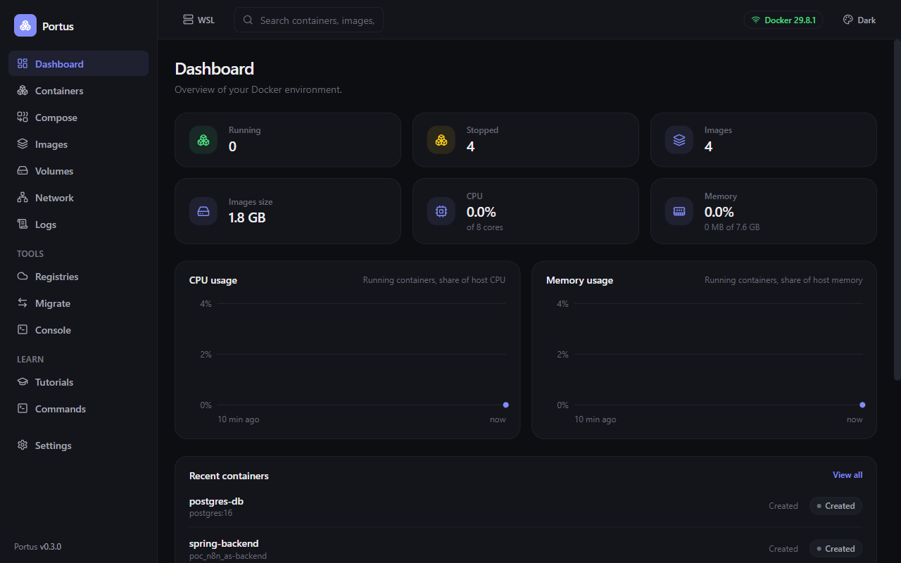
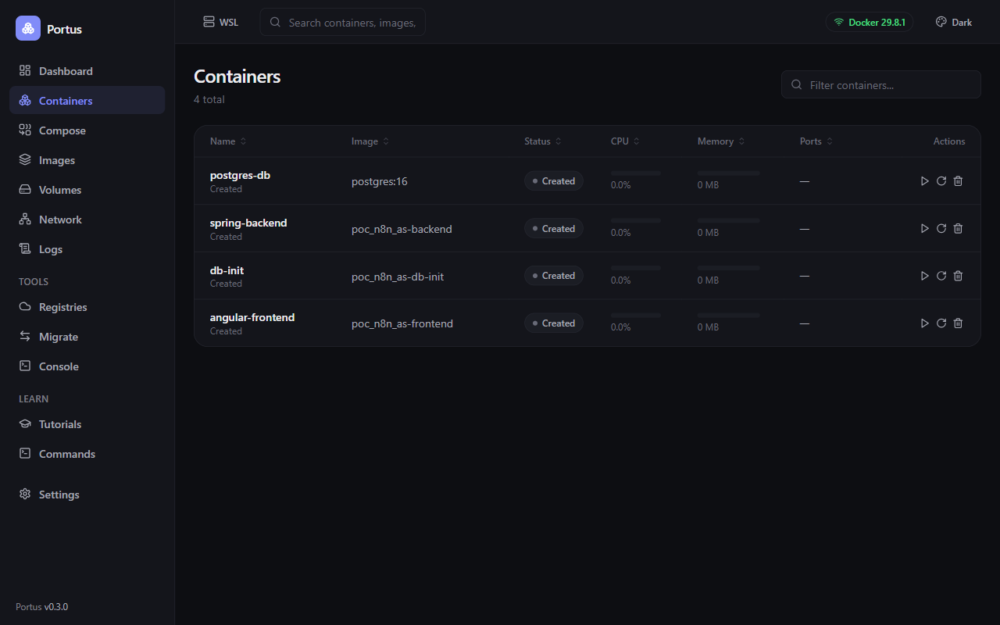
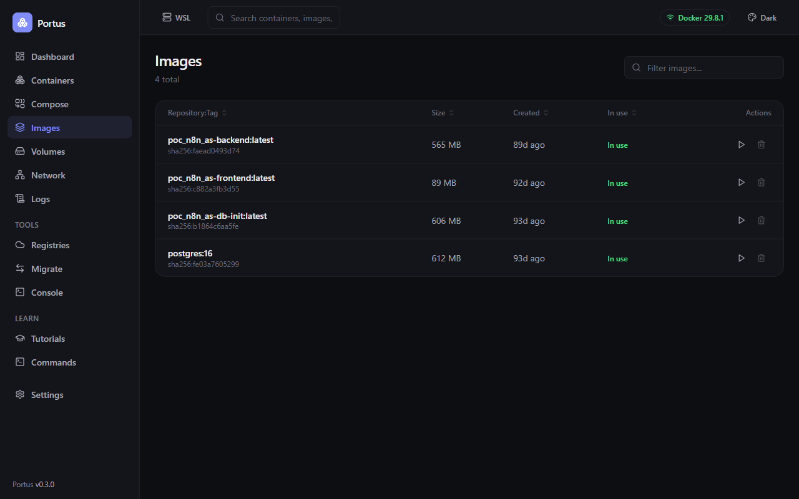
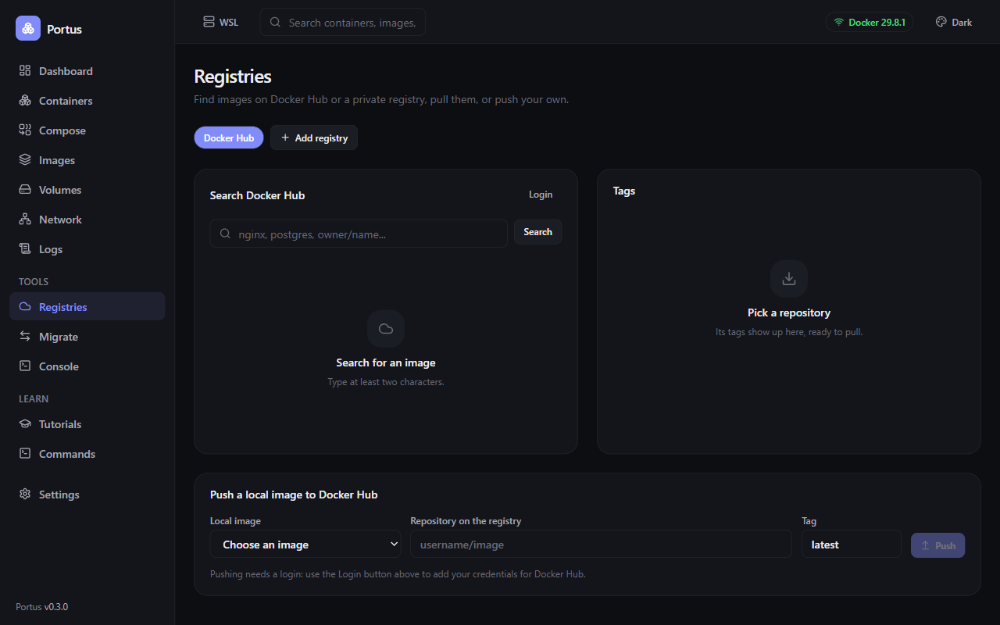
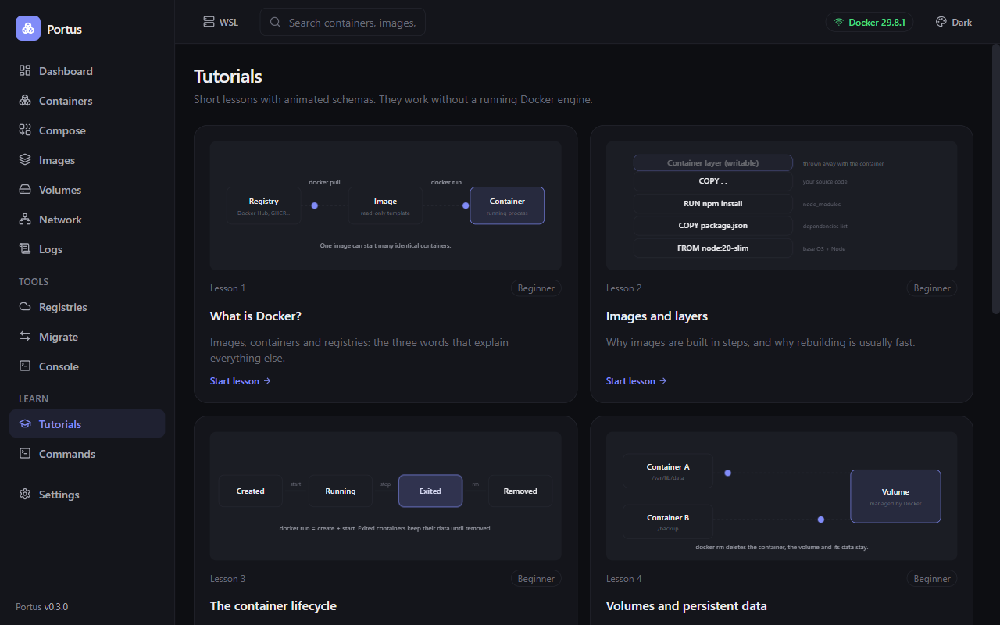

# Portus

**Portus** is a free, open source, lightweight GUI for managing Docker — built in Rust.

It aims to stay simple and fast: no bloated dashboards, no unnecessary features. Just a clean, modern interface for the Docker workflows you use every day.



## Why Portus

- **Lightweight** — small footprint, low memory/CPU usage, native performance thanks to Rust.
- **Simple** — focused feature set, minimal configuration, no learning curve.
- **Modern UI** — clean, responsive, dark/light friendly interface.
- **Open source** — free to use, inspect, and contribute to.

## Features

- **Dashboard** — running and stopped containers, images, live CPU and memory charts.
- **Containers** — list, start, stop, restart, remove, inspect, and view resource usage. Every table sorts by column.
- **Compose** — view and manage Docker Compose projects and their services.
- **Images** — browse, remove and inspect local images, and create a container from one (name, ports, environment).
- **Volumes** — list, inspect, and remove volumes.
- **Network map** — a diagram of host ports, containers and networks: who can talk to whom.
- **Logs** — real-time, streaming log viewer for containers.
- **Registries** — search Docker Hub, GitHub (GHCR), GitLab or any private registry, browse tags, pull and push images.
- **Migrate** — copy or move containers, images and volumes from one engine to another, as a background queue that follows dependencies.
- **Console** — run `docker` commands inside the app, with completion for subcommands and your container, image and volume names.
- **Your engine, your choice** — Docker Desktop, the engine Portus installs and manages in WSL (secured with mutual TLS, no Docker Desktop needed), or any endpoint you enter (Colima, OrbStack, a remote host).
- **Runs in the background** — tray icon, optional start at login, and the WSL engine keeps running when the window closes.
- **Themes** — many light and dark themes, or follow the system.
- **Learn** — short tutorials with animated schemas, and a cheat sheet of useful Docker commands you can extend with your own.
- **Cross-platform** — installers for Windows, macOS and Linux are built by CI on every release.

## Screenshots

| Containers | Images |
| --- | --- |
|  |  |
| **Registries** | **Learn** |
|  |  |

## Status

Portus is under active development. Expect breaking changes until the first stable release.

## Getting Started

Download the installer for your system from the [latest release](../../releases/latest) (Windows, macOS, Linux). macOS builds are unsigned.

To run from source you need [Node.js](https://nodejs.org), [Rust](https://rustup.rs) and the [Tauri prerequisites](https://tauri.app/start/prerequisites/):

```bash
npm install
npm run tauri dev      # run the desktop app
npm run tauri build    # production bundle
```

On Windows Portus needs no Docker Desktop: it can install and manage a Docker Engine inside WSL2 for you.

## Contributing

Contributions, issues, and feature requests are welcome. Feel free to open an issue or submit a pull request.

## License

Open source — license details coming soon.
